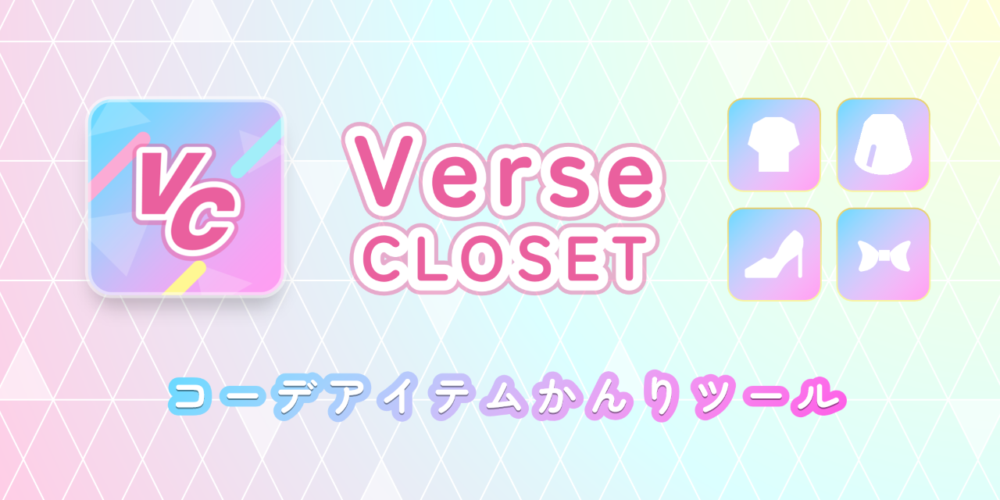

# Verse Closet


コーデアイテムかんりツール 「Verse Closet」



## つかいかた

[Verse Closetのつかいかたはこちら](https://github.com/mtsgi/verse-closet/wiki)

「ホーム画面に追加」または「インストール」がおすすめです

## 開発

開発者向けの環境構築手順の説明です

### Setup

最初にパッケージをインストールします

```bash
npm install
```

次に `.env` に必要な環境変数を記載します

### Development Server

次のコマンドで `http://localhost:3000` で開発サーバーが起動します

```bash
npm run dev -- --host
```

### Production

以下のコマンドで、GitHub Pagesでホスティング可能なSPAとしてビルドします

```bash
npm run build -- --preset github_pages
```
